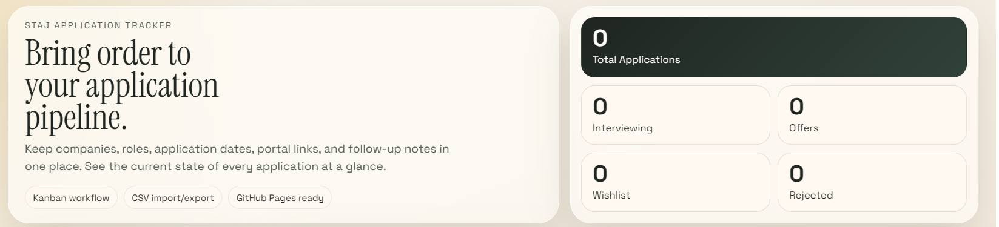
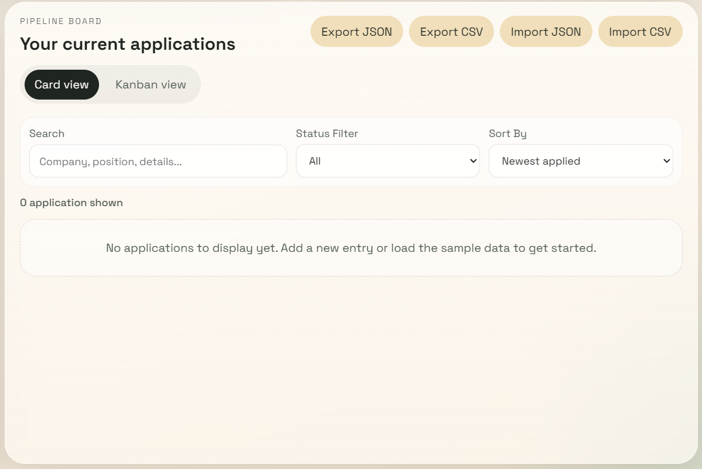
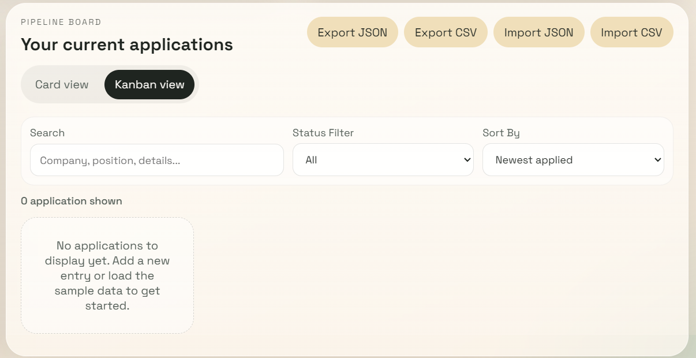
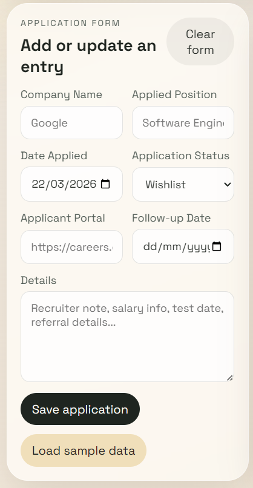

# Staj Tracker

Staj Tracker is a lightweight internship application tracking app built with vanilla HTML, CSS, and JavaScript.

It provides a clean interface for managing internship applications with status tracking, search and filtering, Kanban organization, and CSV/JSON import-export support. All data is stored locally in the browser using `localStorage`.

[Live Demo](https://emirhansariyar.github.io/Staj-Tracker/)

## Overview

Staj Tracker is designed for keeping internship applications organized in one place without relying on spreadsheets or external tools. It focuses on the parts that matter most during application season: knowing where you applied, what stage each application is in, and what requires follow-up.

  

## What It Offers

| Area | Description |
| --- | --- |
| Application Tracking | Store company, role, application date, portal link, notes, and follow-up date in one place. |
| Visual Workflow | Switch between card view and Kanban view to review applications in the format that fits best. |
| Status Management | Update application stages directly from cards and keep the pipeline current. |
| Data Portability | Import and export data with CSV or JSON for backups and flexibility. |

## Interface

Click any preview to open the full-size image.

| Preview | Description |
| --- | --- |
|  | **Card View**  
Scan applications quickly, use filters and sorting controls, and manage multiple entries from a compact board layout. |
|  | **Kanban View**  
Review progress visually across stages and move between application states in a more pipeline-oriented format. |
|  | **Application Form**  
Add new applications, update existing entries, and keep relevant notes and follow-up dates in one place. |

## Highlights

- Card view and Kanban view
- Application status management
- Search, filtering, and sorting
- CSV and JSON import-export
- Local persistence with `localStorage`
- Static deployment with GitHub Pages

## Tech Stack

- HTML
- CSS
- JavaScript

## Project Structure

- `index.html`: Main UI structure
- `styles.css`: Styling and responsive layout
- `app.js`: Application logic, storage, filtering, Kanban, and import-export handling

## Running Locally

Open `index.html` in a browser.

Because the project is fully static, no package installation or build step is required.

## Data Storage

Application data is stored in the browser using `localStorage`.

- Data remains available in the same browser unless storage is cleared
- Backups can be created using the JSON or CSV export options
- Imported files replace the current in-browser dataset
